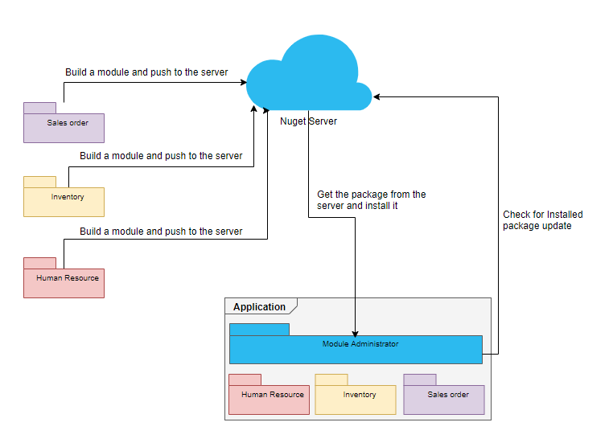

# PlugableApp

This is a c# complete modular application solution built with the goal to manage your application on independent parts. In order to accomplish this goal the solution includes Packaging, Updating, Distributing, Integrating and Installing. Which means that the application can install their own packages (pluggins) using a nuget package server.

This project surge as a solution to a problem I found in several companies that I've been working as a developer. Nowadays there is every kind of solution for every kind of problems out there. In my case, I have a long time looking for a solution that includes a package manager solution.

Seems like there is too much information in one paragraph. Well, that's why I came across with the following diagram in order to let you know the idea with more details:

## Prerequisites

## Installing

## Roanmap

## External Resources

## Contributing

## Author

* **Daniel Tejada**

## Acknowledgments
